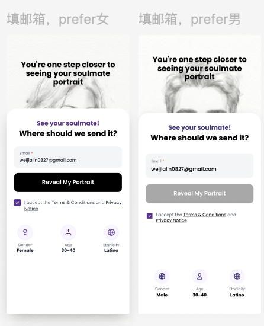

# 灵魂伴侣

[灵魂伴侣问题\&选项\.xlsx](Images_attachments/灵魂伴侣问题&选项.xlsx)

|排序|图示|域名|需求|
|---|---|---|---|
|1||stell\.love/soulmate |1、点击let' begin按钮，进入过渡\-0页 2、点击login进入登录页|
|登录页||||
|过渡\-0||stell\.love/soulmate/loading |点击按钮进入下一页|
|过渡0\-4|||- 过渡\-3     - 根据用户填的生日展示文案里紫色字的部分，规则：如Aries Sun，Taurus Sun     白羊座日期 Aries：3月21日\~4月19日     金牛座日期 Taurus：4月20日\~5月20日     双子座 日期Gemini：5月21日\~6月21日     巨蟹座日期 Cancer：6月22日\~7月22日     狮子座日期 Leo：7月23日\~8月22日     处女座日期 Virgo：8月23日\~9月22日     天秤座日期 Libra：9月23日\~10月23日     天蝎座 日期Scorpio：10月24日\~11月21日     射手座日期 Sagittarius：11月22日～12月20日     摩羯座日期 Capricorn：12月21日 \~ 1月20日     水瓶座 日期Aquarius：1月21日 \~ 2月19日     双鱼座 日期Pisces：2月20日 \~ 3月20日     - 根据用户在问题10里选的不同选项展示不同文案：         - 选heart：people make decisions using their heart\.         - 选head：people make decisions using their head\.         - 选both：people make decisions using their heart and head\.|
|问题||stell\.love/soulmate/quiz|1、根据Excel来，单选题和多选题有对应不一样的样式，单选题点击选项立即跳下一页，多选题未选择选项时按钮为置灰不可点击，选择选项后按钮变成可点击状态，点击进入下一页|
|过渡\-5||stell\.love/soulmate/loading||
|填邮箱||stell\.love/soulmate/email|1. 用户在问题3里选择的性别，男展示男页面，女展示女页面 2. 页面下方展示3个信息，从用户在问题3、5、6的选项里取值|
|订阅页||stell\.love/soulmate/subscribe|1. 用户在问题3里选择的性别，男展示男页面，女展示女页面 2. 开通成功后跳转订阅成功页 |
|订阅成功页|||1、展示灵魂伴侣画像和报告的倒计时状态 2、灵魂伴侣画像展示12小时倒计时，报告展示24小时倒计时，从用户订阅成功后开始计算 3、倒计时结束展示已完成的入口状态|
|灵魂伴侣画像页| |stell\.love/soulmate/sketch |1. 点返回调转到stella\.love/home 2. 一个邮箱只能生成一次，生成后该图片保存，再次进入还是展示该图 3. 画像生成     1. 进入这个页面再使用用户的信息调取模型接口生成，生成时展示loading状态     2. 模型：gpt\-image\-2\-text\-to\-image     3. 需传给模型的值：问题3567的选项     4. 提示词：     ## Soulmate Pencil Portrait Prompt     Create a highly attractive pencil\-sketch portrait of the user's imagined soulmate, based strictly on the demographic and appearance attributes provided below\.     ### Required Attributes     - Gender: \{\{gender\}\}     - Age range: \{\{age\_range\}\}     - Ethnicity / racial appearance: \{\{ethnicity\}\}     - Distinctive features: \{\{features\}\}     ### Character Requirements     The person MUST clearly and naturally match all of the provided attributes\.     Treat the provided gender, age range, ethnicity, and distinctive features as **hard visual constraints**, not optional inspiration\.     Among people who naturally fit these attributes, portray the subject as **conventionally attractive by contemporary mainstream standards**\.     For a male subject, favor a handsome, charismatic, well\-proportioned appearance with harmonious facial features, a defined but natural facial structure, expressive eyes, healthy\-looking hair, and an appealing masculine presence\.     For a female subject, favor a beautiful, elegant, well\-proportioned appearance with harmonious facial features, expressive eyes, healthy\-looking hair, refined features, and an appealing feminine presence\.     Do NOT achieve attractiveness by changing or weakening the specified ethnicity, age, gender presentation, or distinctive features\. The subject should look like an exceptionally attractive person **within the requested demographic and feature profile**\.     The portrait should feel believable and human rather than like an idealized fantasy character or fashion model\.     ### Portrait Composition     Create a single\-person portrait, approximately chest\-up or shoulders\-up\.     The subject should face mostly toward the viewer, with a natural slight three\-quarter angle if aesthetically appropriate\.     Use a calm, subtle, emotionally warm expression with gentle eye contact\. The person should feel attractive, approachable, slightly mysterious, and romantically compelling\.     Keep the pose natural and relaxed\.     The face must be the primary visual focus\.     Do not include another person\.     ### Pencil Sketch Style     Render the portrait as a sophisticated, hand\-drawn graphite pencil sketch on clean, lightly textured off\-white drawing paper\.     Use:     - realistic graphite pencil strokes     - delicate line work     - subtle cross\-hatching     - soft tonal shading     - detailed eyes, eyebrows, lips, hair, and facial structure     - natural skin texture translated into pencil shading     - controlled highlights created through untouched paper     - subtle artistic imperfections characteristic of a real hand\-drawn portrait     The drawing should feel like a highly skilled portrait artist carefully sketched a real person from observation\.     Maintain high facial realism while clearly preserving the traditional pencil\-drawing aesthetic\.     ### Aesthetic Direction     Romantic soulmate portrait, refined, intimate, timeless, emotionally evocative, premium commissioned portrait quality\.     The subject should immediately feel like an attractive real person someone could plausibly meet in everyday life\.     Avoid exaggerated beauty filters, plastic\-looking perfection, anime aesthetics, cartoon features, fantasy styling, glamour photography aesthetics, or hypersexualization\.     ### Background     Use a minimal, mostly blank sketch\-paper background with only very subtle graphite shading around the subject if needed\.     No scenery, no objects, no decorative frame, no text, no names, no zodiac symbols, and no typography\.     ### Priority Order     When resolving the image, follow this priority:     1. Accurately match \{\{gender\}\}     2. Clearly remain within \{\{age\_range\}\}     3. Clearly represent \{\{ethnicity\}\}     4. Faithfully incorporate \{\{features\}\}     5. Maximize conventional attractiveness **within all constraints above**     6. Preserve realistic human anatomy and proportions     7. Preserve the premium graphite pencil\-sketch style     Never sacrifice attributes 1–4 simply to make the person more conventionally attractive\. |
|灵魂伴侣报告页||||
|抽屉页|||新增一个soulmate sketch，非会员点击到stell\.love/soulmate，会员点击到stell\.love/soulmate/sketch|
|设置页||||
||||订阅页 常见问题 - How soon can I expect to receive my sketch and reading? You will receive your sketch and reading within 24 hours\. We require this time to carefully process your information and create a detailed portrait\.  - What does my sketch include? Your sketch includes a detailed portrait of your soulmate, created based on your answers and designed to represent the person most aligned with you\. - Will I recognize my soulmate from the sketch? Many users have shared incredible stories of recognizing their soulmate or meeting someone who resembles the sketch\. While the portrait is based on traits most aligned with you, it’s also a guide to help you feel closer to your destined connection\. Keep an open heart and mind\!|
||||订阅页 假评价 **I couldn't believe my eyes\!** 名字Christi I  couldn't believe my eyes\!  My soulmate sketch tremendously favors the man I met three months ago, and almost instantly fell in love with I think your company is awesome\!  **This drawing looks like a man I'm dating with** 名字Dani This drawing looks like a man I’m already in love with and I believe is my soulmate\. Whether or not that’s not him, this brings back fond memories\.  **Love my soulmate drawing so much\!** 名字：Colleen This soulmate sketch is awesome\. I can't wait til I find my match\. It's not expensive \& if you don't like the one they give you, you can ask them to draw another one\. It's very cool\.  **This is crazy\!** 名字：Richard This is crazy\. I did the soulmate sketch thing for a laugh\. And what they gave me was a near identical pic of the woman I know is my soul mate\. We're together forever\. Really crazy outcome with this pic\.|

